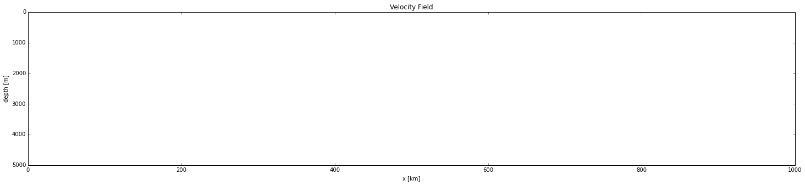
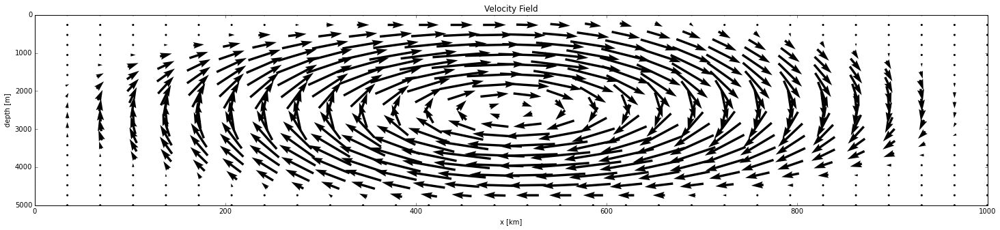
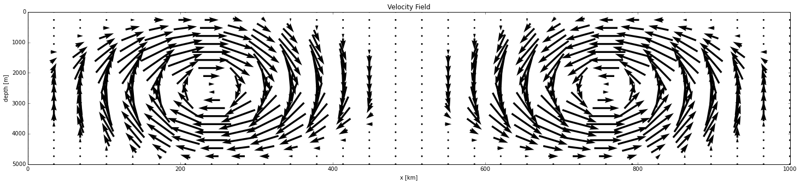

*****************
Preliminary Model
*****************

The preliminary model solves a system of coupled, linear equations. It was initially set up on a 1D domain with a zero background velocity field imposed, and was compared with an analytical solution for consistency.

Next, on a 2D domain. Three different divergenceless background velocity fields were imposed: the zero field, a single cell overturning field, and a two-cell overturning field with upwelling at the domain edges and convergent downwelling in the centre. The single-cell and two-cell velocity field calculations are initialized on the zero-field steady state. Two different advection schemes were implemented: an upstream scheme, and a flux based scheme. The flux based scheme has so far demonstrated more robust stability.   

Points of interest are the time elapsed to reach steady state, the grid resolution required for 90% similarity, and of course the distribution of [Th]/[Pa]. 

The objective of the model is to provide insight into the overturning rate of the Arctic ocean by exploring how the ratio of [Th]/[Pa] responds to forcing from overturning currents.

================
Coupled 1D Model
================

- The steady state is reached after 50 years.

- The grid is 100 x 1, but 20 would be sufficient.

- The solution propogates from surface to seafloor, and linearly increases in magnitude with depth. 

  

The curve corresponding to 10 years shows how the steady state solution, a linear positive slope, is reached first at the surface, where the initial distribution falls out and is not replaced by anything falling from above. The initial distribution has fallen to the 2000m depth level after 10 years, 4000m after 30 years, and completely after 50 years. 

The time for a particle to sink from the surface to the seafloor is given by 

                                                                                t = zmax / S,

however, the time to reach steady state is greater than this, because sinking particles can desorb into the dissolved phase, which do not sink.
====================================
Coupled 2D Model: Underlying Physics
====================================

- The steady state for Th is reached after 100 years, while the steady state for Pa is reached after 1000 years. The order of magnitude difference between the two is caused by the order of magnitude difference in the production, adsorption, and desorption constants that govern the two elements. 

- Initializing the single-cell and two-cell calculations on the zero-field steady state does not change the time to reach steady state.  

- Both solutions propogate from surface to seafloor.

- Upwelling currents are reflected in the concentration profile as regions of high concentration. This is caused by the upward force that suspends particulate matter in the water column. 

- The domain is 5000m by 1000 km, and is discretized into a 20 x 30 grid, which is quite course, but sufficient to resolve 90% of the solution.

Results from upstream calculation:

.. figure:: ../images/2D_1000yr_Pa_0vel_upstream.png

Results from flux based calculation:

.. figure:: ../images/2D_200yr_Pa_1vel_flux.png
.. figure:: ../images/2D_1000yr_Pa_1vel_flux.png

Results from upstream calculation:

Note the unstability that develops after 600 years in the upstream calculation:

Results from flux based calculation:

Results from upstream calculation:

==============================
Coupled 2D Model: Steady State
==============================

**[Th]** 	
		- zero velocity:        100 years

		- single cell velocity: 100 years

		- two cell velocity:    100 years

**[Pa]** 	
		- zero velocity:        1000 years

		- single cell velocity: 1000 years

		- two cell velocity:    1000 years

**[Th] / [Pa]**	
		- zero velocity: 

		- single cell velocity:

		- two cell velocity:

=========================
Coupled 2D Model: Th2D.py
=========================

.. function:: Th2D.adflow(T, V, u, nz, nx, k_ad, k_de, Q, flowfig)
	
	Compute and store the dissolved and particulate [Th] profiles, 
	write them to a file, plot the results.

	:arg T: scale for tmax such that tmax = T*(g.zmax - g.zmin)/S 
	:type T: int

	:arg V: scale for ux, uz, which are originally order 1.
	:type V: int

	:arg u: 3D tensor of shape [nz, nx, 2]. Stores z component of velocity in [:, :, 1], x component of velocity in [:, :, 2] 
	:type u: float

	:arg nz: number of grid points in z dimension
	:type nz: int

	:arg nx: number of grid points in x dimension
	:type nx: int

	:arg k_ad: nz x nx adsorption rate matrix
	:type k_ad: float

	:arg k_de: nz x nx adsorption rate matrix
	:type k_de: float

	:arg adscheme: function to implement the desired advection scheme 
	:type adscheme: function

.. function:: Th2D.u_simple(xmin, xmax, zmin, zmax, nx, nz)

	Compute a simple rotational, divergenceless flow field 
	on a specified grid.

	:arg xmin: minimum x on the grid
	
	:arg xmax: maximum x on the grid

	:arg zmin: minimum z on the grid

	:arg zmax: maximum z on the grid

	:arg nx: number of points in x dimension

	:arg nz: number of points in z dimension	

.. function:: Th2D.u_complex(xmin, xmax, zmin, zmax, nx, nz)

	Compute a rotational, downwelling velocity field.

	:arg xmin: minimum x on the grid

	:arg xmax: maximum x on the grid

	:arg zmin: minimum z on the grid

	:arg zmax: maximum z on the grid

	:arg nx: number of points in x dimension

	:arg nz: number of points in z dimension

.. function:: Th2D.k_sorp(string, xmin, xmax, zmin, zmax, nx, nz)

	Compute adsorption,desorption, & production constants for 
	Th or Pa.

	:arg string: a string, either 'Th' or 'Pa'

	:arg xmin: minimum x on the grid

	:arg xmax: maximum x on the grid

	:arg zmin: minimum z on the grid

	:arg zmax: maximum z on the grid

	:arg nx: number of points in x dimension

	:arg nz: number of points in z dimension

.. function:: Th2D.plotratio(DTh, DPa, PTh, PPa, xmin, xmax, zmin, zmax, nx, nz, T)

	Plot the ratio T/P and output to notebook.

	:arg DTh: 2D profile of dissolved Th

	:arg PTh: 2D profile of particulate Th

	:arg DPa: 2D profile of dissolved Pa	

	:arg PPa: 2D profile of particulate Pa

	:arg xmin: minimum x on the grid

	:arg xmax: maximum x on the grid

	:arg zmin: minimum z on the grid

	:arg zmax: maximum z on the grid

	:arg nx: number of points in x dimension

	:arg nz: number of points in z dimension

	:arg T: scale for tmax such that tmax = T*(g.zmax - g.zmin)/S
	:type T: int

